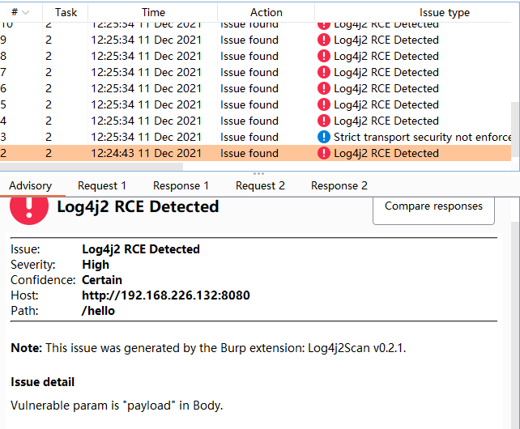

# Log4j2Scan

> 本工具仅供学习研究自查使用，切勿用于非法用途，由使用该工具产生的一切风险均与本人无关！  

Log4j2 远程代码执行漏洞，BurpSuite被动扫描插件。 

版本停留在原作者的v2.0版本左右 

暂只支持Url、Cookie、POST(x-www-form-urlencoded)类型的参数fuzz。

# 碎碎念
不会JAVA，当晚面向百度学习，小学生水平的代码，轻喷  
由于原作者项目中支持的两个平台当时不能用，于是为了测试使用，临时修改支持了另一个DNSLOG平台  
原项目需要遍历替换所有的Cookie参数和URL参数以及POST参数来注入log4j2的POC语句  
但是个人认为遇到一些参数量较大的请求的话，发包量有点大，并且还需要依靠外部DNSLOG平台，不稳定，不是很推荐被动扫描的形式    
个人更加偏向于Burpsuite的主动扫描形式，定向对数据包检测，而且建议自搭DNSLOG平台  

# 修改
[+] 删除DNSLOG和CEYE平台支持，换成新DNSLOG平台

[+] Cookie和Get参数只遍历一次，Post参数只遍历两次

# 鸣谢
代码基本借鉴于以下项目
https://github.com/whwlsfb/Log4j2Scan
